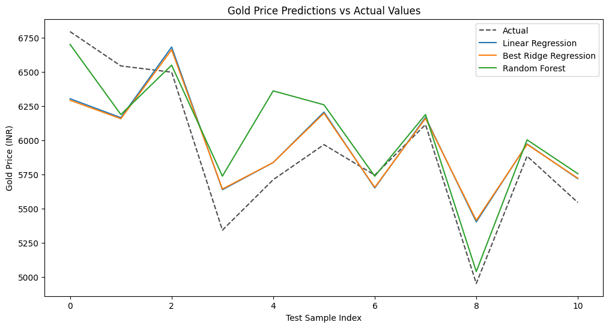
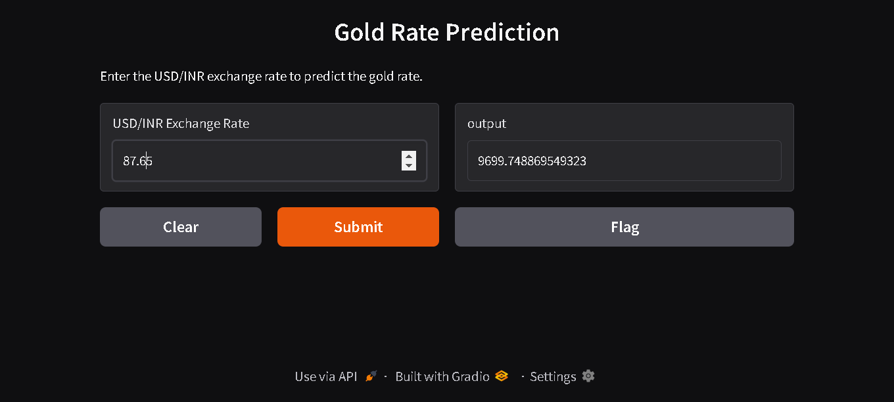

# **Gold Price Prediction Using Machine Learning** 🏆


This project focuses on predicting gold prices in INR using machine learning and time-series forecasting models. The objective is to develop a robust model for forecasting gold prices based on historical trends and economic factors.

---

## **Table of Contents**
- [Introduction](#introduction)
- [Dataset](#dataset)
- [Features](#features)
- [Installation](#installation)
- [Usage](#usage)
- [Modeling Techniques](#modeling-techniques)
- [Evaluation Metrics](#evaluation-metrics)
- [Results](#results)
- [App Demo](#app-demo)
- [Contributing](#contributing)
- [License](#license)

---
## **Directory Structure**

itzdineshx-gold-price-prediction/
├── README.md                # Project documentation
├── requirements.txt          # List of dependencies for the project
├── assets/                   # Folder for storing project-related images and plots
│   └── img/
│       └── plots/            # Directory for plots generated during the analysis
├── data/                     # Folder for dataset files
│   ├── Gold vs USDINR.csv    # Gold price dataset file
│   └── USDINR.csv            # USD/INR exchange rate dataset file
├── models/                   # Folder for storing trained model files
│   ├── Regression_model.pkl  # Saved linear regression model
│   ├── best_lin_reg_ridge_model.pkl  # Best Ridge regression model
│   ├── best_random_forest_model.pkl  # Best Random Forest model
│   ├── regressor.pkl         # Additional regressor model
│   ├── ridge_model.pkl       # Ridge regression model
│   └── scaler.pkl            # Feature scaler object
├── notebook/                 # Jupyter Notebook directory
│   └── Gold_price_usdinr_prediction.ipynb  # Main project notebook
├── src/                      # Source code directory
│   ├── app.py                # Gradio app for interactive predictions
│   └── .gradio/
│       └── certificate.pem   # Security certificate for Gradio app (if any)
└── .gradio/                  # Gradio configuration directory
    └── certificate.pem       # SSL certificate for secure communication


## **Introduction**  
Gold prices are highly volatile and influenced by numerous economic factors. Accurate price prediction can assist investors and traders in making informed decisions. This project applies various machine learning and time-series models to predict gold prices using historical data.

---

## **Dataset**
- **Source:** [Exchange Rate.org](https://www.exchange-rates.org/precious-metals/gold-price/india)  
- **Description:** Historical gold prices with corresponding currency rates, economic indicators, or other relevant features.  
- **Sample Columns:**  
  - Date  
  - Gold Price in INR  
  - USD/INR Exchange Rate  

---

## **Features**
Key features used in the model:
- **Date:** Time-series index for the analysis  
- **Gold Price:** Target variable for prediction  
- **USD/INR Exchange Rate:** Currency conversion rates  

---

## **Installation**

1. Clone this repository:
   ```bash
   git clone <repository-url>
   cd Gold_price_prediction
   ```

2. Install the required dependencies:
   ```bash
   pip install -r requirements.txt
   ```

---

## **Usage**
1. Run the notebook:
   ```bash
   jupyter notebook Gold_price_usdinr_prediction.ipynb
   ```

2. Start the Gradio interface for user-friendly interaction:
   ```bash
   python app.py
   ```

---

## **Modeling Techniques**
The following models were explored and compared:
- **Linear Regression:** Simple regression model for baseline predictions.  
- **Ridge Regression:** Regularized regression to handle overfitting.  
- **Random Forest:** Ensemble method for robust predictions.  

---

## **Evaluation Metrics**
Key evaluation metrics used:
- **Mean Squared Error (MSE)**  
- **Root Mean Squared Error (RMSE)**  
- **R-Squared Score (R²)**  

---

## **Results**
| **Model**               | **MSE**        | **RMSE**       | **R-Squared** |
|--------------------------|---------------|----------------|---------------|
| Linear Regression        | 75,693.83     | 122.12         | 0.724         |
| Best Ridge Regression    | 77,648.52     | 278.65         | 0.717         |
| Random Forest            | 81,500.74     | 285.48         | 0.703         |




---

## **App Demo**
The application includes a simple and interactive **Gradio** interface that allows users to:  
- Input features for gold price prediction  
- Visualize predicted gold prices  
- Compare predicted values with historical trends  

**Demo Screenshot:**  


---

## **Contributing**
Contributions are welcome!  
1. Fork this repository.  
2. Create a new branch (`feature-branch`).  
3. Commit your changes and push them.  
4. Submit a pull request.

---

## **License**
This project is licensed under the [MIT License](LICENSE).


---
